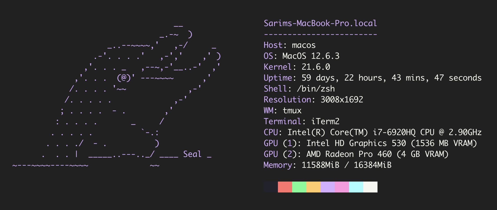
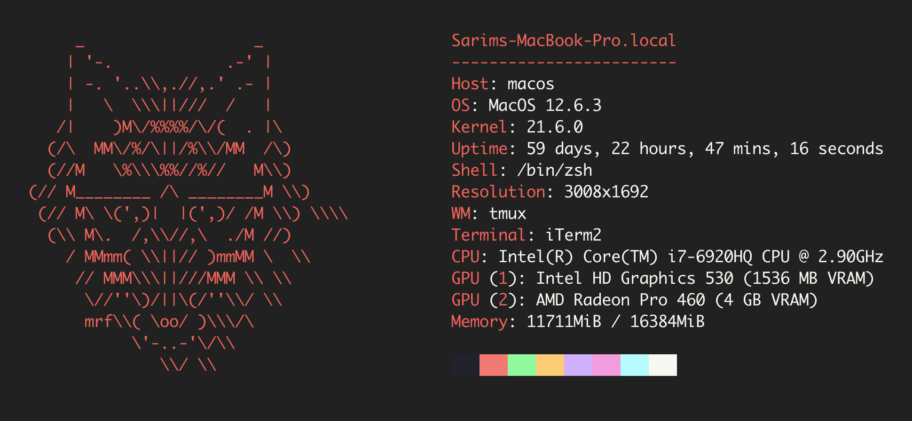

# SysFetch




## Overview

### Key Features
- **System Information**: Gather comprehensive data about your operating system, hardware, and more.
- **Custom Themes**: Personalize your experience with beautiful themes.
- **Speed**

### Limitations
- **Only MacOS**: Expanding capability to Linux and Windows

## Installation
```bash
brew tap sarimdev/sysfetch && brew install sysfetch
```
